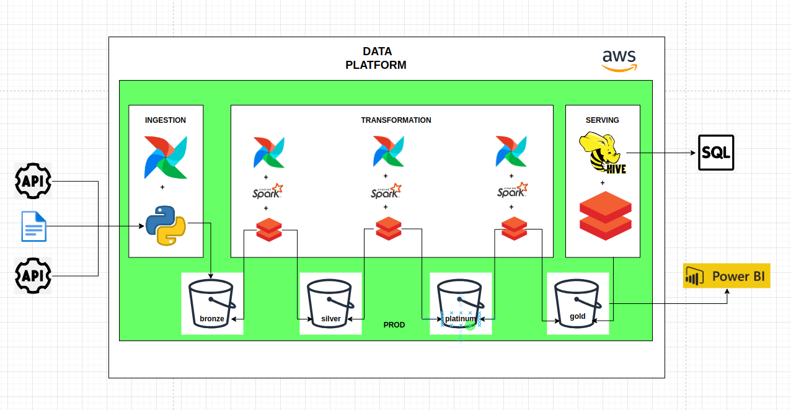

    1. Datalake com Estrutura de Medalhão (Bronze, Silver, Platinum, Gold):
        ◦ Vantagens: A estrutura de medalhão permite a segmentação dos dados com base em sua qualidade e utilidade. Os dados brutos (Bronze) são armazenados inicialmente, passando por fases de refinamento até atingirem a qualidade máxima (Gold). Isso facilita o gerenciamento, a manutenção e a escalabilidade do datalake.
    2. Airflow no Cluster de EKS + Python para Ingestão na Bronze:
        ◦ Vantagens: O Airflow oferece uma plataforma robusta para agendar, monitorar e orquestrar pipelines de dados. A integração com EKS (Elastic Kubernetes Service) permite escalabilidade e flexibilidade no gerenciamento de contêineres, enquanto o uso de Python facilita a criação de scripts de ingestão personalizados. O custo de processamento no EKS é absurdamente baixo comparado a outros métodos de processamentos. 
    3. Databricks + Spark + Airflow para ETL (Silver, Platinum, Gold):
        ◦ Vantagens: Databricks oferece um ambiente unificado para análise de dados com suporte nativo ao Apache Spark. O Spark fornece alto desempenho para processamento distribuído, sendo altamente eficiente para tarefas ETL. A integração com Airflow permite agendamento e orquestração robustos, enquanto o Databricks facilita a colaboração e o desenvolvimento eficiente.
    4. Apache Hive para Leitura dos Dados na Gold:
        ◦ Vantagens: O Apache Hive é uma camada de abstração sobre o Hadoop, que permite consultar dados usando SQL-like queries em uma arquitetura de processamento distribuído. Usar Hive na camada Gold facilita o acesso do cliente final aos dados refinados de maneira familiar, usando consultas SQL, promovendo a agilidade e simplificando a análise de dados.
    5. Benefícios Globais da Arquitetura:
        ◦ Escalabilidade: A arquitetura é altamente escalável, pois utiliza tecnologias como Kubernetes e Spark, que podem se adaptar facilmente a um aumento no volume de dados ou na complexidade do processamento.
        ◦ Orquestração e Agendamento: A integração do Airflow em diferentes etapas da arquitetura fornece um mecanismo poderoso para orquestrar e agendar tarefas de forma eficiente.
        ◦ Flexibilidade e Eficiência: O uso de linguagem Python em várias etapas permite flexibilidade na criação de scripts, operadores e pipelines, facilitando a manutenção e o desenvolvimento.

